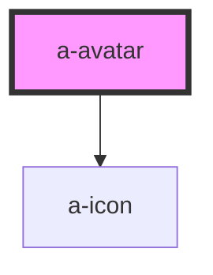

# a-avatar

<!-- Auto Generated Below -->

## Properties

| Property   | Attribute  | Description                                                                                | Type                                | Default    |
| ---------- | ---------- | ------------------------------------------------------------------------------------------ | ----------------------------------- | ---------- |
| `alt`      | `alt`      | Alternative text for the image.                                                            | `string`                            | `''`       |
| `image`    | `image`    | The image source to use for the avatar.                                                    | `string`                            | `''`       |
| `initials` | `initials` | Initials to use as a fallback when no image is available (1-2 characters max recommended). | `string`                            | `''`       |
| `shape`    | `shape`    | The shape of the avatar.                                                                   | `"circle" \| "rounded" \| "square"` | `'circle'` |

## Shadow Parts

| Part         | Description |
| ------------ | ----------- |
| `"base"`     |             |
| `"icon"`     |             |
| `"image"`    |             |
| `"initials"` |             |

## CSS Custom Properties

| Name     | Description             |
| -------- | ----------------------- |
| `--size` | The size of the avatar. |

## Dependencies

### Depends on

- [a-icon](../icon)

### Graph

----------------------------------------------

*Built with [StencilJS](https://stenciljs.com/)*
