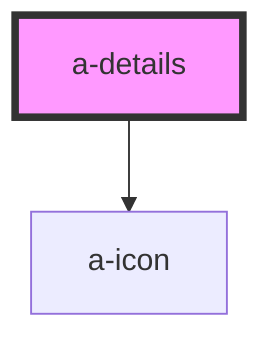

# a-details

<!-- Auto Generated Below -->

## Properties

| Property   | Attribute  | Description                                                                                             | Type      | Default |
| ---------- | ---------- | ------------------------------------------------------------------------------------------------------- | --------- | ------- |
| `disabled` | `disabled` | Set to true to prevent the user from toggling the details.                                              | `boolean` | `false` |
| `open`     | `open`     | Indicates whether or not the details is open. You can use this in lieu of the show/hide methods.        | `boolean` | `false` |
| `summary`  | `summary`  | The summary to show in the details header. If you need to display HTML, use the `summary` slot instead. | `string`  | `''`    |

## Events

| Event         | Description                                                                                          | Type               |
| ------------- | ---------------------------------------------------------------------------------------------------- | ------------------ |
| `slAfterHide` | Emitted after the details closes and all transitions are complete.                                   | `CustomEvent<any>` |
| `slAfterShow` | Emitted after the details opens and all transitions are complete.                                    | `CustomEvent<any>` |
| `slHide`      | Emitted when the details closes. Calling `event.preventDefault()` will prevent it from being closed. | `CustomEvent<any>` |
| `slShow`      | Emitted when the details opens. Calling `event.preventDefault()` will prevent it from being opened.  | `CustomEvent<any>` |

## Methods

### `hide() => Promise<void>`

Hides the alert

#### Returns

Type: `Promise<void>`

### `show() => Promise<void>`

Shows the alert.

#### Returns

Type: `Promise<void>`

## Shadow Parts

| Part             | Description |
| ---------------- | ----------- |
| `"base"`         |             |
| `"content"`      |             |
| `"header"`       |             |
| `"summary"`      |             |
| `"summary-icon"` |             |

## Dependencies

### Depends on

- [a-icon](../icon)

### Graph

----------------------------------------------

*Built with [StencilJS](https://stenciljs.com/)*
