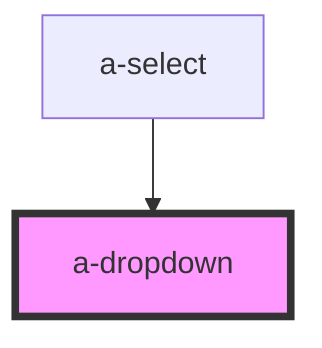

# a-dropdown

<!-- Auto Generated Below -->

## Properties

| Property            | Attribute         | Description                                                                                                                                | Type                                                                                                                                                                 | Default          |
| ------------------- | ----------------- | ------------------------------------------------------------------------------------------------------------------------------------------ | -------------------------------------------------------------------------------------------------------------------------------------------------------------------- | ---------------- |
| `closeOnSelect`     | `close-on-select` | Determines whether the dropdown should hide when a menu item is selected.                                                                  | `boolean`                                                                                                                                                            | `true`           |
| `containingElement` | --                | The dropdown will close when the user interacts outside of this element (e.g. clicking).                                                   | `HTMLElement`                                                                                                                                                        | `this.host`      |
| `distance`          | `distance`        | The distance in pixels from which to offset the panel away from its trigger.                                                               | `number`                                                                                                                                                             | `2`              |
| `open`              | `open`            | Indicates whether or not the dropdown is open. You can use this in lieu of the show/hide methods.                                          | `boolean`                                                                                                                                                            | `false`          |
| `placement`         | `placement`       | The preferred placement of the dropdown panel. Note that the actual placement may vary as needed to keep the panel inside of the viewport. | `"bottom" \| "bottom-end" \| "bottom-start" \| "left" \| "left-end" \| "left-start" \| "right" \| "right-end" \| "right-start" \| "top" \| "top-end" \| "top-start"` | `'bottom-start'` |
| `skidding`          | `skidding`        | The distance in pixels from which to offset the panel along its trigger.                                                                   | `number`                                                                                                                                                             | `0`              |

## Events

| Event         | Description                                                                                           | Type               |
| ------------- | ----------------------------------------------------------------------------------------------------- | ------------------ |
| `slAfterHide` | Emitted after the dropdown closes and all transitions are complete.                                   | `CustomEvent<any>` |
| `slAfterShow` | Emitted after the dropdown opens and all transitions are complete.                                    | `CustomEvent<any>` |
| `slHide`      | Emitted when the dropdown closes. Calling `event.preventDefault()` will prevent it from being closed. | `CustomEvent<any>` |
| `slShow`      | Emitted when the dropdown opens. Calling `event.preventDefault()` will prevent it from being opened.  | `CustomEvent<any>` |

## Methods

### `hide() => Promise<void>`

Hides the dropdown panel

#### Returns

Type: `Promise<void>`

### `show() => Promise<void>`

Shows the dropdown panel

#### Returns

Type: `Promise<void>`

## Shadow Parts

| Part        | Description |
| ----------- | ----------- |
| `"base"`    |             |
| `"panel"`   |             |
| `"trigger"` |             |

## Dependencies

### Used by

 - [a-select](../select)

### Graph

----------------------------------------------

*Built with [StencilJS](https://stenciljs.com/)*
