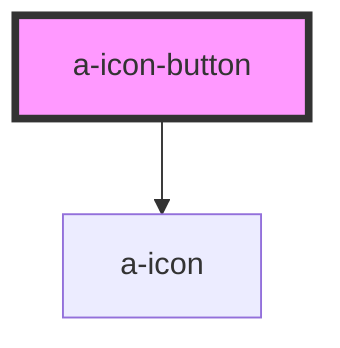

# a-icon-button

<!-- Auto Generated Below -->

## Properties

| Property   | Attribute  | Description                                                                                                   | Type      | Default     |
| ---------- | ---------- | ------------------------------------------------------------------------------------------------------------- | --------- | ----------- |
| `disabled` | `disabled` | Set to true to disable the button.                                                                            | `boolean` | `false`     |
| `label`    | `label`    | An alternative description to use for accessibility. If omitted, the name or src will be used to generate it. | `string`  | `undefined` |
| `name`     | `name`     | The name of the icon to draw. See the icon component for a full list of icons.                                | `string`  | `undefined` |
| `src`      | `src`      | An external URL of an SVG file.                                                                               | `string`  | `undefined` |

## Shadow Parts

| Part     | Description |
| -------- | ----------- |
| `"base"` |             |

## Dependencies

### Depends on

- [a-icon](../icon)

### Graph

----------------------------------------------

*Built with [StencilJS](https://stenciljs.com/)*
