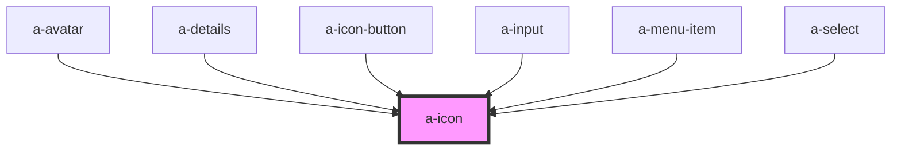

# a-icon

<!-- Auto Generated Below -->

## Properties

| Property | Attribute | Description                                                                                                   | Type     | Default     |
| -------- | --------- | ------------------------------------------------------------------------------------------------------------- | -------- | ----------- |
| `label`  | `label`   | An alternative description to use for accessibility. If omitted, the name or src will be used to generate it. | `string` | `undefined` |
| `name`   | `name`    | The name of the icon to draw.                                                                                 | `string` | `undefined` |
| `src`    | `src`     | An external URL of an SVG file.                                                                               | `string` | `undefined` |

## Events

| Event    | Description                           | Type               |
| -------- | ------------------------------------- | ------------------ |
| `aError` | Emitted when the icon failed to load. | `CustomEvent<any>` |
| `aLoad`  | Emitted when the icon has loaded.     | `CustomEvent<any>` |

## Shadow Parts

| Part     | Description |
| -------- | ----------- |
| `"base"` |             |

## Dependencies

### Used by

 - [a-avatar](../avatar)
 - [a-details](../details)
 - [a-icon-button](../icon-button)
 - [a-input](../input)
 - [a-menu-item](../menu-item)
 - [a-select](../select)

### Graph

----------------------------------------------

*Built with [StencilJS](https://stenciljs.com/)*
