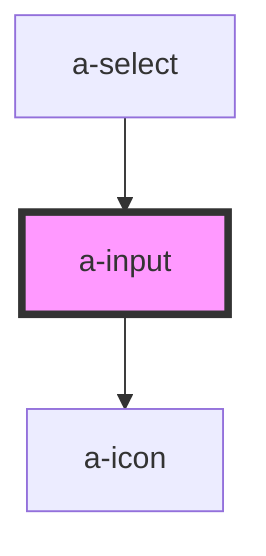

# a-icon-input

<!-- Auto Generated Below -->

## Properties

| Property         | Attribute         | Description                                                      | Type                                                                                  | Default     |
| ---------------- | ----------------- | ---------------------------------------------------------------- | ------------------------------------------------------------------------------------- | ----------- |
| `autocapitalize` | `autocapitalize`  | The input's autocaptialize attribute.                            | `string`                                                                              | `undefined` |
| `autocomplete`   | `autocomplete`    | The input's autocomplete attribute.                              | `string`                                                                              | `undefined` |
| `autocorrect`    | `autocorrect`     | The input's autocorrect attribute.                               | `string`                                                                              | `undefined` |
| `autofocus`      | `autofocus`       | The input's autofocus attribute.                                 | `boolean`                                                                             | `undefined` |
| `clearable`      | `clearable`       | Set to true to add a clear button when the input is populated.   | `boolean`                                                                             | `false`     |
| `disabled`       | `disabled`        | Set to true to disable the input.                                | `boolean`                                                                             | `false`     |
| `inputmode`      | `inputmode`       | The input's inputmode attribute.                                 | `"decimal" \| "email" \| "none" \| "numeric" \| "search" \| "tel" \| "text" \| "url"` | `undefined` |
| `invalid`        | `invalid`         | Set to true to indicate that the user input is invalid.          | `boolean`                                                                             | `false`     |
| `label`          | `label`           | The input's label.                                               | `string`                                                                              | `''`        |
| `max`            | `max`             | The input's max attribute.                                       | `number`                                                                              | `undefined` |
| `maxlength`      | `maxlength`       | The input's maxlength attribute.                                 | `number`                                                                              | `undefined` |
| `min`            | `min`             | The input's min attribute.                                       | `number`                                                                              | `undefined` |
| `minlength`      | `minlength`       | The input's minlength attribute.                                 | `number`                                                                              | `undefined` |
| `name`           | `name`            | The input's name attribute.                                      | `string`                                                                              | `''`        |
| `pattern`        | `pattern`         | The input's pattern attribute.                                   | `string`                                                                              | `undefined` |
| `pill`           | `pill`            | Set to true to draw a pill-style input with rounded edges.       | `boolean`                                                                             | `false`     |
| `placeholder`    | `placeholder`     | The input's placeholder text.                                    | `string`                                                                              | `undefined` |
| `readonly`       | `readonly`        | Set to true for a readonly input.                                | `boolean`                                                                             | `false`     |
| `required`       | `required`        | The input's required attribute.                                  | `boolean`                                                                             | `undefined` |
| `size`           | `size`            | The input's size.                                                | `"large" \| "medium" \| "small"`                                                      | `'medium'`  |
| `step`           | `step`            | The input's step attribute.                                      | `number`                                                                              | `undefined` |
| `togglePassword` | `toggle-password` | Set to true to add a password toggle button for password inputs. | `boolean`                                                                             | `false`     |
| `type`           | `type`            | The input's type.                                                | `"email" \| "number" \| "password" \| "search" \| "tel" \| "text" \| "url"`           | `'text'`    |
| `valid`          | `valid`           | Set to true to indicate that the user input is valid.            | `boolean`                                                                             | `false`     |
| `value`          | `value`           | The input's value attribute.                                     | `string`                                                                              | `''`        |

## Events

| Event      | Description                               | Type               |
| ---------- | ----------------------------------------- | ------------------ |
| `slBlur`   | Emitted when the control loses focus.     | `CustomEvent<any>` |
| `slChange` | Emitted when the control's value changes. | `CustomEvent<any>` |
| `slFocus`  | Emitted when the control gains focus.     | `CustomEvent<any>` |
| `slInput`  | Emitted when the control receives input.  | `CustomEvent<any>` |

## Methods

### `removeFocus() => Promise<void>`

Removes focus from the input.

#### Returns

Type: `Promise<void>`

### `select() => Promise<void>`

Selects all the text in the input.

#### Returns

Type: `Promise<void>`

### `setFocus() => Promise<void>`

Sets focus on the input.

#### Returns

Type: `Promise<void>`

### `setRangeText(replacement: string, start: number, end: number, selectMode?: 'select' | 'start' | 'end' | 'preserve') => Promise<void>`

Replaces a range of text with a new string.

#### Returns

Type: `Promise<void>`

### `setSelectionRange(selectionStart: number, selectionEnd: number, selectionDirection?: 'forward' | 'backward' | 'none') => Promise<void>`

Sets the start and end positions of the text selection (0-based).

#### Returns

Type: `Promise<void>`

## Shadow Parts

| Part                       | Description |
| -------------------------- | ----------- |
| `"base"`                   |             |
| `"clear-button"`           |             |
| `"form-control"`           |             |
| `"help-text"`              |             |
| `"input"`                  |             |
| `"label"`                  |             |
| `"password-toggle-button"` |             |
| `"prefix"`                 |             |
| `"suffix"`                 |             |

## Dependencies

### Used by

 - [a-select](../select)

### Depends on

- [a-icon](../icon)

### Graph

----------------------------------------------

*Built with [StencilJS](https://stenciljs.com/)*
