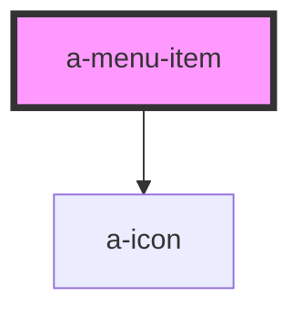

# a-menu-item

<!-- Auto Generated Below -->

## Properties

| Property   | Attribute  | Description                                            | Type      | Default |
| ---------- | ---------- | ------------------------------------------------------ | --------- | ------- |
| `active`   | `active`   | Set to true to draw the menu item in an active state.  | `boolean` | `false` |
| `checked`  | `checked`  | Set to true to draw the item in a checked state.       | `boolean` | `false` |
| `disabled` | `disabled` | Set to true to draw the menu item in a disabled state. | `boolean` | `false` |
| `value`    | `value`    | A unique value to store in the menu item.              | `string`  | `''`    |

## Events

| Event          | Description                                  | Type               |
| -------------- | -------------------------------------------- | ------------------ |
| `slActivate`   | Emitted when the menu item becomes active.   | `CustomEvent<any>` |
| `slDeactivate` | Emitted when the menu item becomes inactive. | `CustomEvent<any>` |

## Shadow Parts

| Part             | Description |
| ---------------- | ----------- |
| `"base"`         |             |
| `"checked-icon"` |             |
| `"label"`        |             |
| `"prefix"`       |             |
| `"suffix"`       |             |

## Dependencies

### Depends on

- [a-icon](../icon)

### Graph

----------------------------------------------

*Built with [StencilJS](https://stenciljs.com/)*
