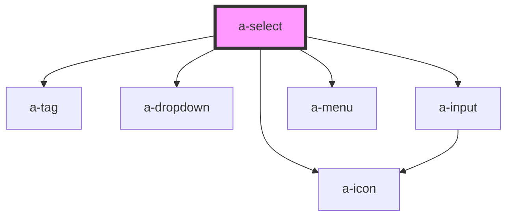

# a-select

<!-- Auto Generated Below -->

## Properties

| Property         | Attribute          | Description                                                                                                                                                                                    | Type                             | Default    |
| ---------------- | ------------------ | ---------------------------------------------------------------------------------------------------------------------------------------------------------------------------------------------- | -------------------------------- | ---------- |
| `disabled`       | `disabled`         | Set to true to disable the select control.                                                                                                                                                     | `boolean`                        | `false`    |
| `invalid`        | `invalid`          | Set to true to indicate that the user input is invalid.                                                                                                                                        | `boolean`                        | `false`    |
| `label`          | `label`            | The select's label.                                                                                                                                                                            | `string`                         | `''`       |
| `maxTagsVisible` | `max-tags-visible` | The maximum number of tags to show when `multiple` is true. After the maximum, "+n" will be shown to indicate the number of additional items that are selected. Set to -1 to remove the limit. | `number`                         | `3`        |
| `multiple`       | `multiple`         | Set to true to enable multiselect.                                                                                                                                                             | `boolean`                        | `false`    |
| `name`           | `name`             | The select's name.                                                                                                                                                                             | `string`                         | `''`       |
| `pill`           | `pill`             | Set to true to draw a pill-style select with rounded edges.                                                                                                                                    | `boolean`                        | `false`    |
| `placeholder`    | `placeholder`      | The select's placeholder text.                                                                                                                                                                 | `string`                         | `''`       |
| `size`           | `size`             | The select's size.                                                                                                                                                                             | `"large" \| "medium" \| "small"` | `'medium'` |
| `valid`          | `valid`            | Set to true to indicate that the user input is valid.                                                                                                                                          | `boolean`                        | `false`    |
| `value`          | `value`            | The value of the control. This will be a string or an array depending on `multiple`.                                                                                                           | `string \| string[]`             | `''`       |

## Events

| Event      | Description                               | Type               |
| ---------- | ----------------------------------------- | ------------------ |
| `slBlur`   | Emitted when the control loses focus      | `CustomEvent<any>` |
| `slChange` | Emitted when the control's value changes. | `CustomEvent<any>` |
| `slFocus`  | Emitted when the control gains focus      | `CustomEvent<any>` |

## Shadow Parts

| Part             | Description |
| ---------------- | ----------- |
| `"base"`         |             |
| `"form-control"` |             |
| `"help-text"`    |             |
| `"icon"`         |             |
| `"input"`        |             |
| `"label"`        |             |
| `"menu"`         |             |
| `"tags"`         |             |

## Dependencies

### Depends on

- [a-tag](../tag)
- [a-dropdown](../dropdown)
- [a-input](../input)
- [a-icon](../icon)
- [a-menu](../menu)

### Graph

----------------------------------------------

*Built with [StencilJS](https://stenciljs.com/)*
