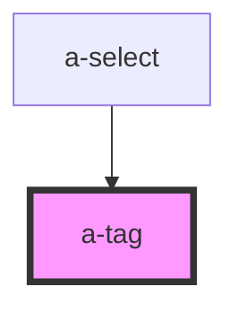

# a-tag

<!-- Auto Generated Below -->

## Properties

| Property    | Attribute   | Description                                              | Type                                                                  | Default     |
| ----------- | ----------- | -------------------------------------------------------- | --------------------------------------------------------------------- | ----------- |
| `clearable` | `clearable` | Set to true to make the tag clearable.                   | `boolean`                                                             | `false`     |
| `pill`      | `pill`      | Set to true to draw a pill-style tag with rounded edges. | `boolean`                                                             | `false`     |
| `size`      | `size`      | The tag's size.                                          | `"large" \| "medium" \| "small"`                                      | `'medium'`  |
| `type`      | `type`      | The tag's type.                                          | `"danger" \| "info" \| "primary" \| "success" \| "text" \| "warning"` | `'primary'` |

## Events

| Event     | Description                                 | Type               |
| --------- | ------------------------------------------- | ------------------ |
| `slClear` | Emitted when the clear button is activated. | `CustomEvent<any>` |

## Shadow Parts

| Part             | Description |
| ---------------- | ----------- |
| `"base"`         |             |
| `"clear-button"` |             |
| `"content"`      |             |

## Dependencies

### Used by

 - [a-select](../select)

### Graph

----------------------------------------------

*Built with [StencilJS](https://stenciljs.com/)*
